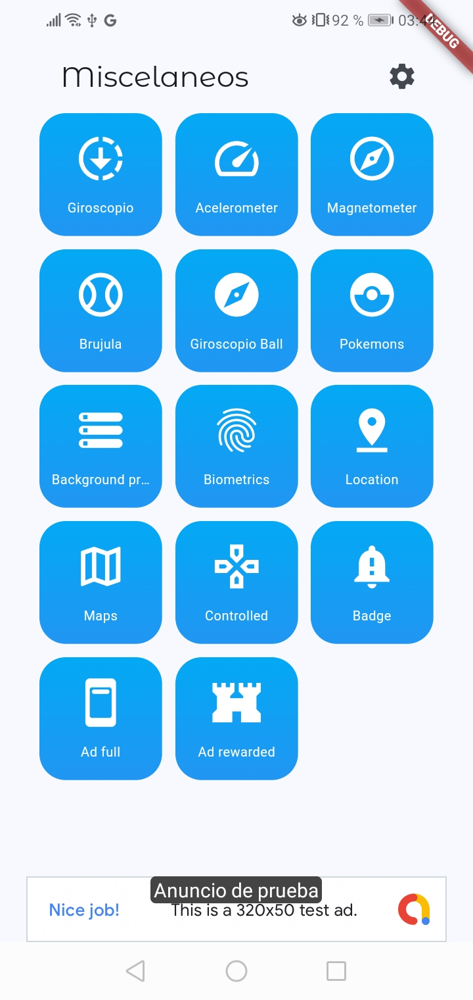
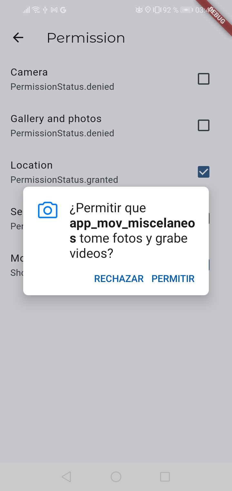

# Miscelaneos App

A new Flutter project.

Change minSdk to 20 => flutter_compass

Change setting.properties in build
id "org.jetbrains.kotlin.android" version "1.8.0" apply false


Rename App ID
```
flutter pub run change_app_package_name:main com.carlossrreyes97.app_mov_miscelaneos
```
sha-256
```
cd android
./gradlew signingReport
```


##Generador de codigo
```
flutter pub run build_runner build
```


**Miscelaneos images:**




